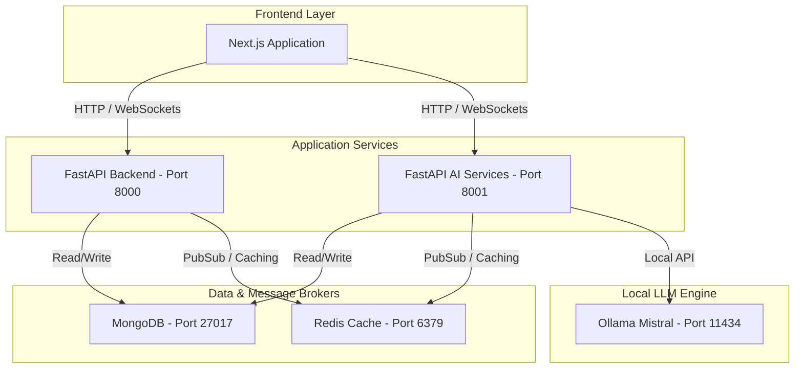

# Devflow 🌌

Devflow is an AI-powered visual workflow planning and execution workspace. It coordinates a team of cooperative, specialized AI agents to analyze project ideas, construct structured system requirements, design architectural plans, assess risk, estimate budgets, and build executable software blueprints.

---

## 🏗️ System Architecture



---

## 📁 Project Structure

The project is structured as a monorepo containing three core components and infrastructure configurations:

```
Devflow/
├── backend/               # FastAPI Backend Service (Port 8000)
│   ├── app/
│   │   ├── api/          # Endpoints and routers
│   │   ├── core/         # Config, security, database connections
│   │   ├── db/           # Database session management
│   │   ├── middleware/   # Request logging, CORS, rate limiting
│   │   ├── models/       # Pydantic schemas and database models
│   │   ├── orchestrator/ # Business logic for agent workflows
│   │   ├── utils/        # Shared helper functions
│   │   └── main.py       # FastAPI application entry point
│   ├── Dockerfile
│   └── requirements.txt
│
├── ai-services/           # FastAPI AI Services & Agents (Port 8001)
│   ├── agents/           # Specialized AI Agent implementations (e.g., Risk AI)
│   ├── llm/              # LLM wrapper & connection configs
│   ├── memory/           # Agent session and historical memory management
│   ├── services/         # Orchestration helper services
│   ├── tools/            # Custom agent action tools (APIs, search, etc.)
│   ├── utils/            # Helper functions
│   ├── workflows/        # Langgraph / sequential workflow definitions
│   ├── main.py           # FastAPI application entry point
│   ├── Dockerfile
│   └── requirements.txt
│
├── frontend/              # Next.js 16 Client App (Port 3000)
│   ├── app/              # Next.js App Router pages and layouts
│   ├── components/       # UI Components (Workspace, Theme, Layouts)
│   ├── hooks/            # Custom React hooks
│   ├── lib/              # Zustand stores, utility functions
│   ├── public/           # Static assets
│   └── styles/           # CSS styles & global configurations
│
├── Makefile              # Shortcut commands for running & building
└── docker-compose.yml     # Multi-container local deployment configuration
```

---

## 🚀 Running the Project

### Prerequisites

Ensure you have the following installed on your system:
- **Docker** and **Docker Compose**
- **Node.js** (v18+ if running frontend locally outside of Docker)
- **Make** (optional, for CLI shortcuts)

### Quick Start with Docker

The easiest way to boot the complete environment (Ollama Mistral, Backend, AI Services, MongoDB, Redis) is via the `Makefile`:

```bash
# Build the Docker containers
make build-dev

# Run all services
make dev
```

> [!NOTE]
> When you run `make dev` or `make build-dev`, the Makefile automatically:
> 1. Boots up the containerized **Ollama** service.
> 2. Waits for the Ollama daemon to become ready.
> 3. Automatically runs `ollama pull mistral` inside the container to ensure the target local model is cached and ready.
> 4. Starts the rest of the application ecosystem.

Alternatively, you can use raw Docker Compose commands:

```bash
# Start all services (if mistral model is already pulled)
docker compose up
```

### Accessing the Applications

Once the system is up and running, you can access the components at the following URLs:

| Component | URL | Description |
| :--- | :--- | :--- |
| **Frontend UI** | `http://localhost:3000` | Main interactive workspace planner dashboard |
| **Backend API Docs** | `http://localhost:8000/docs` | Interactive Swagger UI for Backend APIs |
| **AI Services Docs** | `http://localhost:8001/docs` | Interactive Swagger UI for AI Agent APIs |
| **MongoDB** | `mongodb://localhost:27017` | Central metadata & document database |
| **Redis** | `redis://localhost:6379` | Real-time state cache & pub/sub broker |

---

## 🚦 Health Check & Swagger UI Testing

Both Python-based services expose a `/health` endpoint to verify database and cache connectivity. You can test these directly from Swagger UI or via `curl`:

### Backend Health Check
```bash
curl http://localhost:8000/health
```

### AI Services Health Check
```bash
curl http://localhost:8001/health
```

#### Example Healthy Response:
```json
{
  "status": "healthy",
  "version": "1.0.0",
  "uptime_seconds": 12.34,
  "dependencies": {
    "redis": "healthy",
    "mongodb": "healthy"
  }
}
```

---

## 🛠️ Makefile Command Reference

| Command | Action |
| :--- | :--- |
| `make dev` | Start all services via docker-compose |
| `make build-dev` | Build/Rebuild all docker-compose service containers |
| `make down` | Tear down docker-compose containers |
| `make restart` | Restart all active docker-compose services |
| `make logs` | Stream logs for all docker-compose services |
| `make backend` | Open a bash terminal inside the running backend container |
| `make ai` | Open a bash terminal inside the running ai-services container |
| `make mongo` | Open a MongoDB shell inside the database container |
| `make redis` | Open a Redis CLI inside the cache container |
| `make prune` | Prune unused Docker system images, volumes, and networks |
